<p align="center">
  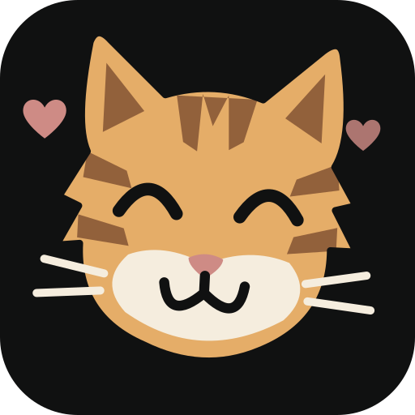
</p>

<h1 align="center">Cat Companion</h1>

<p align="center"><strong>Version 1.0</strong></p>

Sleeps through your day. Wants your entire evening.

A cat simulator and virtual cat companion for your Stream Deck. A bit like a Tamagotchi, with whiskers, mood swings and very little respect for your work schedule.

Press for attention or hold and release to give a treat. Choose from six coats and four temperaments, name your cat and set its sleep schedule. Add optional Food bowl and Litter box keys to feed it and clean up after it. Get more cats to keep each other company, feel less bored and demand a little less attention from you. They can play together, squabble and get jealous over treats, because sharing your desk does not mean sharing your affection. Everything stays on your device.

Requires **Stream Deck 6.9+**, **macOS 13+** or **Windows 11 (64-bit)**. Windows compatibility is declared but has not been validated yet.

If you find this useful, follow @teamvrotek on [GitHub](https://github.com/teamvrotek) or [Instagram](https://www.instagram.com/teamvrotek/). Your support helps us feel more special, thank you.

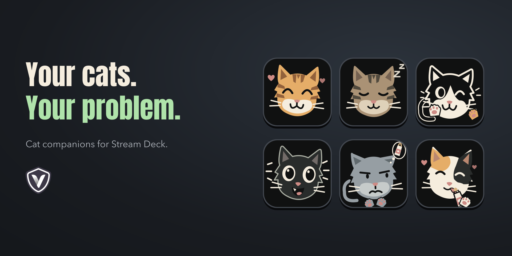

## Install and set up

Stream Deck supplies the plugin's runtime. You do not need to install Node.js to use a built installer.

1. Build the installer using [Build from source](#build-from-source).
2. Open `Release/com.teamvrotek.catattention.streamDeckPlugin` and follow Stream Deck's installation prompt.
3. Find **Cat Companion** in the action list and drag **Cat Companion** onto a key.
4. Select the key to choose its **Appearance**, **Temperament** and **Appetite**, optionally give it a **Name**, and set its **Sleep schedule**.
5. Leave **Animate cat** on for moving expressions, or turn it off for still frames. Add another **Cat Companion** key for another cat.
6. Optionally add **Food bowl** and **Litter box** keys on the same page. They link automatically when one cat is visible. With several cats, choose one cat or **All cats on this page** in each care key’s settings.

## Your cats, your keys

Choose **ginger tabby**, **brown tabby**, **tuxedo**, **black**, **gray** or **calico**. Every coat shares the same silhouette and expressions, with its own markings.

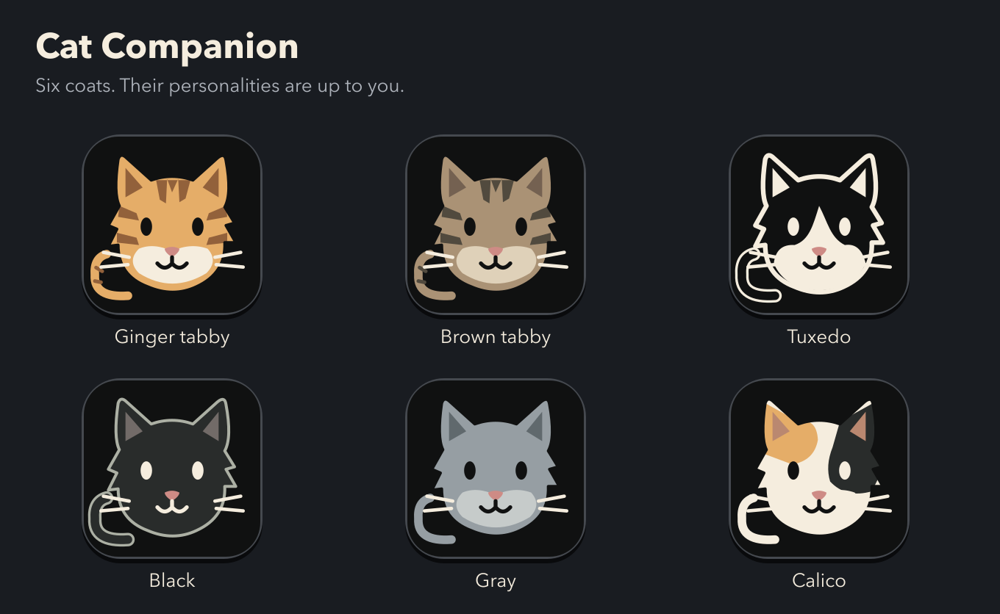

Choose the temperament separately:

| Temperament | What to expect |
|---|---|
| Chill | Easygoing, with gentler responses and quicker recovery. |
| Clingy | Wants more company and shows affection readily. |
| Playful | Enjoys energetic attention and little pounces. |
| Sensitive | Reaches its limit sooner and needs more quiet time. |

Every cat key keeps its own name, appearance, temperament, appetite, schedule and cat state. The 30 expressions cover naps, attention, play, treats, meals, grooming, private litter visits, overfeeding, attacks and a lingering bad mood. [See the expression sheet](docs/images/mood-library.png).

Turning off **Animate cat** keeps the cat's routines and reactions running. The picture still changes with its mood. **Reset this cat** starts that key's cat again after confirmation.

## Cats together

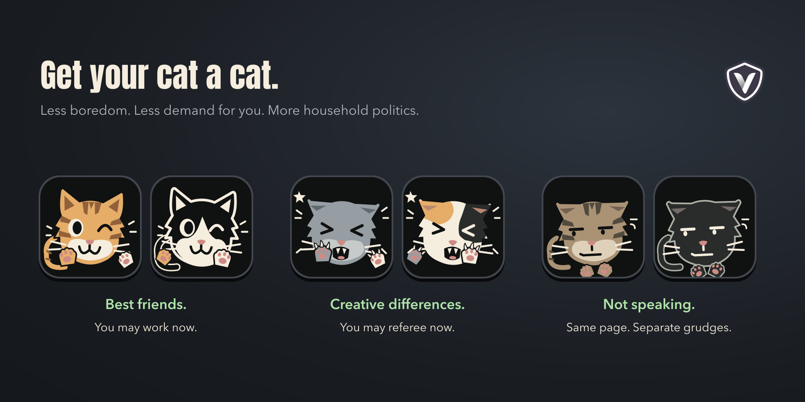

Visible cats on the same Stream Deck page keep each other company. Their need for human attention builds 35% more slowly, and finishing a play session reduces it a little. They still want you around. Cats on another page or device do not join in.

Awake cats can pair up for fifteen seconds of play, with the first opportunity after about three to six minutes together. Later opportunities are fifteen to thirty-five minutes apart, when both cats are free. About one in five play sessions turns into a six-second squabble, followed by two minutes of sulking. Meals, treats, litter visits and stronger moods take priority.

Give only one cat a Churu and the others notice after four seconds. A jealous face lasts up to ninety seconds; their own treat settles that complaint. There is a ten-second grace period for a cat that just got its treat, so feeding them one after another is fair. Repeated treats do not keep restarting jealousy.

| Company, with occasional complaints | Bribery has witnesses |
|---|---|
| 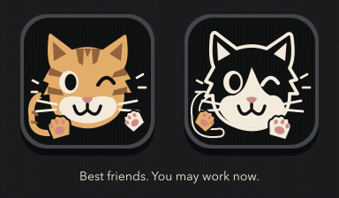 | 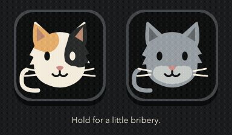 |
| Two friendly paws can become a small disagreement. The sulk lasts longer than the fight. | Hold, release, then count the witnesses. Treating the other cat clears its jealousy. |

*Play, the squabble and the sulk are shown as short excerpts. The Churu animation keeps the real hold thresholds and four-second jealousy delay.*

## A day with your cat

| Day | Evening | Night |
|---|---|---|
| 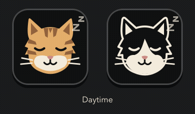 | 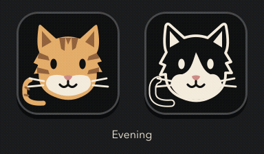 | 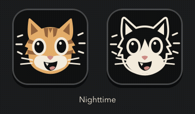 |
| Mostly asleep. A press earns a smile, then it wants its nap back. | Content at first, then asking for attention, then grumpy. A press brings a brief response and eases its need for company. | Zoomies, a breather and sleep. A press brings the next burst of energy forward. |

*Animations show the expressions in sequence. Longer waits and recovery are shortened in these illustrations.*

The default schedule starts daytime at **08:00**, evening at **18:00** and night at **23:00**, using your computer's local time. Adjust these times in each key's settings to give your cats different routines.

## Learn when enough is enough

Each cat keeps track of energy, its need for attention, stimulation and affection separately. A cat can enjoy your company and still need a break from being touched. Rapid tapping builds stimulation faster, and its temperament changes how quickly it reaches its limit. These reactions and timings are tuned for a virtual pet.

Watch the ears, eyes and tail for the first warning. Keep going and the cat turns away with a blocking paw, then retreats. Ignore all of that with relentless tapping and it attacks with a hiss, swiping paws and claws. After the attack it stays visibly mad. More tapping prolongs the bad mood; ordinary attention does not immediately earn another smile.

The attack starts after **16 consecutive rapid taps**, each less than 0.9 seconds apart. It lasts **10 seconds**, followed by **90–180 seconds** of anger depending on temperament. Ordinary overload leaves a shorter **45–75 second** grudge. Warnings linger for five seconds and firmer boundaries for eight, unless a successful treat helps earlier. A happy response lasts five seconds. Escalating contact can still interrupt these reactions.

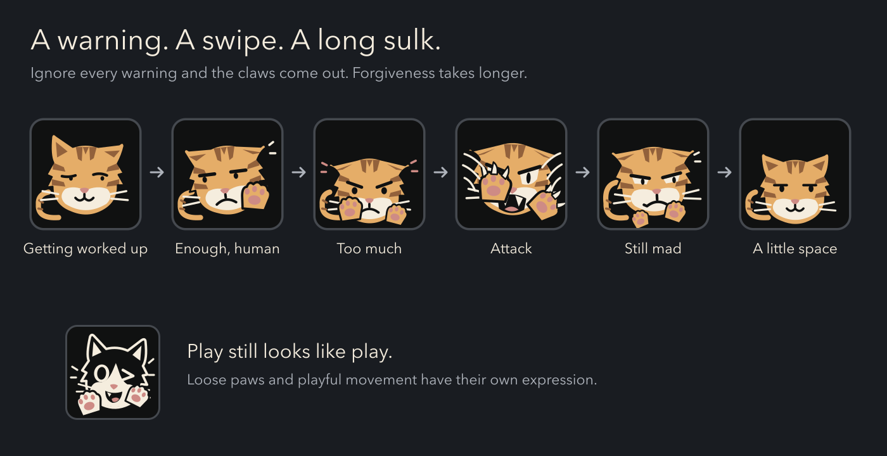

Ordinary affection follows the cat's mood: a sleepy smile during a nap, a headbutt when it wants company, cheek rubbing when relaxed, or a pounce when playful. Play fighting keeps its own loose, lively expression. Overstimulation has a clear warning and withdrawal sequence. Attacks have sharper, forward movement, followed by a quieter but still angry stare.

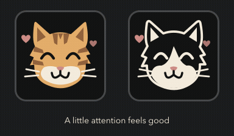

## Hold for a treat

**Hold for 0.7 seconds, then release to give a treat.** A progress bar fills along the top of the key and stays full until you let go. The cat eats for three seconds, spends two seconds cleaning up, then has a longer affectionate period: 30 seconds when sleepy, 45 when calm or 20 when active.

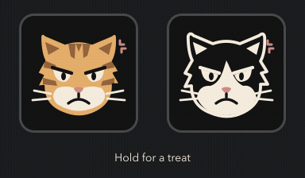

Releasing a completed hold gives one treat. Let go before the bar fills to give ordinary attention; a full bar means the treat is ready to give when you release. Another treat starts a fresh eating sequence. Affection has a limit, and existing stimulation remains. A Churu-style treat is a peace offering: let the cat finish eating and grooming without poking it. That can clear mild irritation or shorten a deeper grudge. A furious cat may guard its food and still need quiet time before showing its love. Only the first undisturbed meal can help during an angry spell. Repeated treats cannot force instant forgiveness.

A grumpy cat starts protectively, then warms to the food. Another treat during eating gets an eager grab; one during love gets an affectionate response. [See the feeding expressions](docs/images/treat-contexts.png).

Six Churu treats within ten minutes is too much of a good thing. The cat finishes its mouthful, pukes for six seconds, then spends twenty seconds cleaning up. More pressing does not restart the reaction. A ten-minute cooldown keeps it from becoming a loop. It is a brief mess, and then cat business resumes.

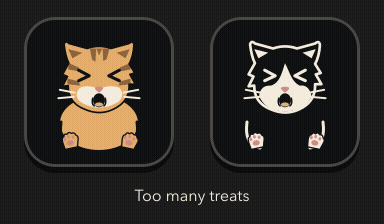

*The clean-up is shortened in this animation.*

## Meals, washing and private business

| Key | What it does | Your job |
|---|---|---|
| Cat Companion | Lives its day, eats, washes, naps and has opinions. | Tap for attention or hold for a treat. |
| Food bowl | Serves one cat or every cat on the page and gradually empties. | Click to refill. |
| Litter box | Gives one cat or every cat on the page a private place to go. | Hold for 3 seconds, then release to clean. |

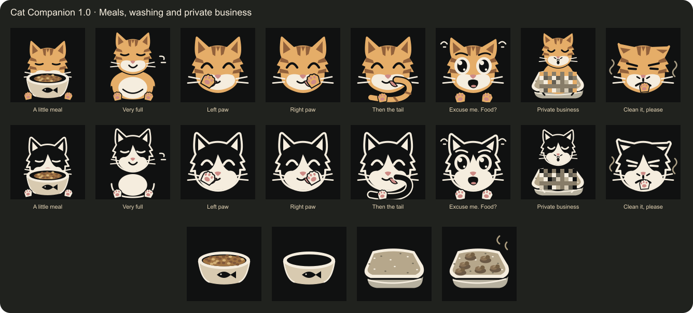

A newly linked bowl gets its first meal after roughly one to three minutes. Between meals, the cat also stops for small nibbles. A meal takes 12 seconds and uses 30% of the bowl; a nibble takes four seconds and uses 6%. Both keys show the same eating moment, and the bowl empties as the cat eats. A full bowl holds three full meals and a little left over if there are no nibbles in between. Click to refill it immediately.

Fresh food gets noticed. If the bowl was at 25% or less, refilling it attracts the cat for a meal after about a second. It can wake from a nap or leave an ordinary wash for the bowl. An attack, a mouthful of Churu, a litter visit or an overfeeding clean-up finishes first. Topping up a fuller bowl does not call the cat over, and topping up while it is already eating does not restart that meal.

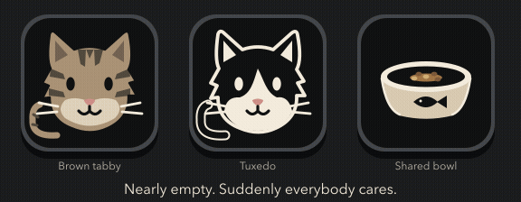

*Two cats, one bowl, no manners. This shows the real one-second arrival delay and twelve-second shared meal. Each cat eats its own 30% portion.*

Set **Appetite** separately for each cat. **Normal** is the default. These are randomized intervals on the real clock, while the cat and its linked care keys are visible together. Appetite changes meals, nibbles and litter visits; mood and attention timings stay the same.

| Appetite | Meals | Small nibbles | Litter visits |
|---|---|---|---|
| Light eater | Every 120–180 minutes | Every 45–75 minutes | Every 90–180 minutes |
| Normal | Every 90–150 minutes | Every 25–45 minutes | Every 1–2 hours |
| Hungry | Every 45–90 minutes | Every 15–30 minutes | Every 45–90 minutes |

Food contributes to the next litter visit. Eating a full meal brings it forward by 22.5 minutes, and a small nibble by 4.5 minutes. Smaller portions have a proportionally smaller effect. Each Churu brings it forward by twenty minutes and puts it within forty-five minutes, unless a visit was already due sooner. Food does not force a new visit sooner than ten minutes away or within twenty minutes of the last completed visit. These effects only apply while a linked litter box is active.

A due litter visit takes priority over repeated treats. Leave the bowl empty for about half an hour and the cat puts on its most dramatic hungry face. It is asking for food. It never becomes ill or dies.

A meal leaves the cat looking full, then washing its left paw, right paw and tail for one to two minutes before a 10 to 30 minute nap. A nibble is a quick snack, with no extended wash or nap afterward. Several treats in a short spell can lead to the full meal routine after the current treat response finishes. The start of daytime also brings a wash before bed. Ordinary attention, strong moods and treats still have their own reactions.

A newly linked litter box gets its first visit after about eight to twelve minutes. Later visits follow the cat's appetite, roughly one to two hours apart on Normal before food and treats bring them forward. The cat closes its eyes, pinches its nose and disappears behind a little privacy mosaic. Each finished visit leaves another clump. After six visits, an unclean box earns a grumpy reminder.

Hold the litter box key for three seconds, then release to clean it. The progress bar fills as you hold and stays full to show you can let go. Cleaning happens when you release. Releasing before the bar fills cancels. The same green check used by Caffeine Tracker confirms the clean and fades away within three seconds. You can clean during a visit; the current visit can still leave a fresh clump afterward.

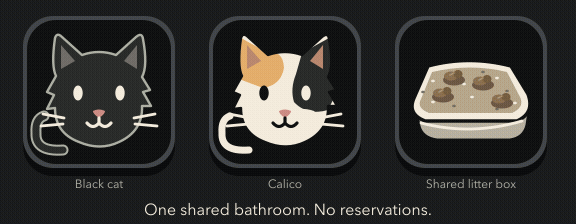

*The shared box starts with four visits. Two more cats fill it, one at a time. Visits are shortened here; the three-second cleaning hold, release and confirmation keep their real timing.*

Each bowl and litter box can belong to one selected cat or **All cats on this page**. Duplicate individual keys mirror that cat’s supplies. Shared keys of the same kind on a page mirror one shared bowl or box. A cat normally uses its individual care key when one is present, otherwise it uses the shared key. Refilling a nearly empty shared bowl attracts every cat on the page, including cats with their own bowls. They eat at the same time, each taking its own portion from the shared food. Cats take turns in a shared litter box, and every visit adds to the same six-visit capacity. Individual supplies stay separate. Keep the cat and its care keys visible on the same Stream Deck page. Removing a care key, changing pages or disconnecting the device pauses its requirement. Food and litter do not run down while Stream Deck is closed. With only a cat key, you have the original attention-and-treat companion with no chores.

The routine borrows the idea of frequent small meals and plenty of sleep from cats, while its intervals and reactions are playful design choices. [Cats Protection: feeding](https://www.cats.org.uk/help-and-advice/diet/feeding), [Cats Protection: sleep](https://www.cats.org.uk/help-and-advice/cat-behaviour/cats-and-sleep).

## Build from source

Building requires **Node.js 20.5.1 or later** and npm. From the repository root:

```sh
npm ci
npm run build
```

The installer is written to `Release/com.teamvrotek.catattention.streamDeckPlugin`. Open it to install the plugin. The final installer keeps the release version exactly **1.0**.

## Customize the artwork

Edit [renderer.js](com.teamvrotek.catattention.sdPlugin/lib/renderer.js) to change coat markings, eyes, mouth shapes or movement. All six coats share one face rig on a 144 × 144 SVG canvas. The README images are rendered examples of that source. Attention and mood values live in [behavior.js](com.teamvrotek.catattention.sdPlugin/lib/behavior.js). Meals, grooming, naps and litter routines live in [routine.js](com.teamvrotek.catattention.sdPlugin/lib/routine.js). Shared play, squabbles and Churu jealousy live in [social.js](com.teamvrotek.catattention.sdPlugin/lib/social.js).

The renderer can also be used directly from a Node.js ES module or browser module:

```js
import { renderKey } from './com.teamvrotek.catattention.sdPlugin/lib/renderer.js';

const svg = renderKey({ cat: 'ginger', mode: 'love', variant: 'calm', phase: 0.25 });
```

It returns an SVG string. `renderButton()` from the same module returns an SVG data URI. Run `npm run build` after editing the source to create an updated installer.

## Privacy

No account is needed. The plugin makes no external network requests. Each cat's settings and state stay in Stream Deck's local key settings on your computer. Its counters survive a restart, and time away allows it to settle naturally.

## License

MIT, see [LICENSE](LICENSE). Copyright © 2026 VROTEK OÜ.
